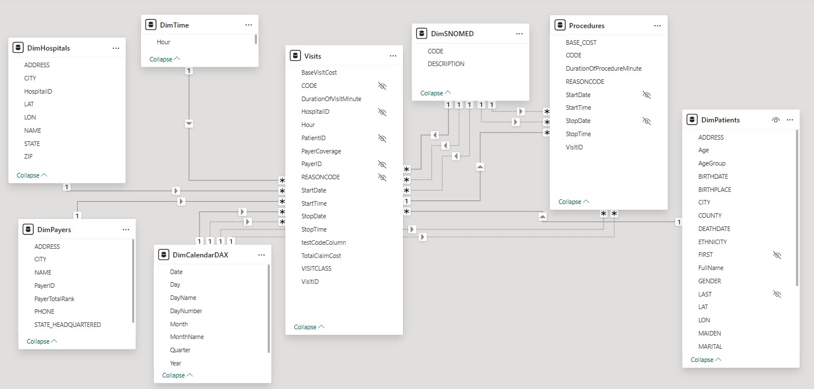
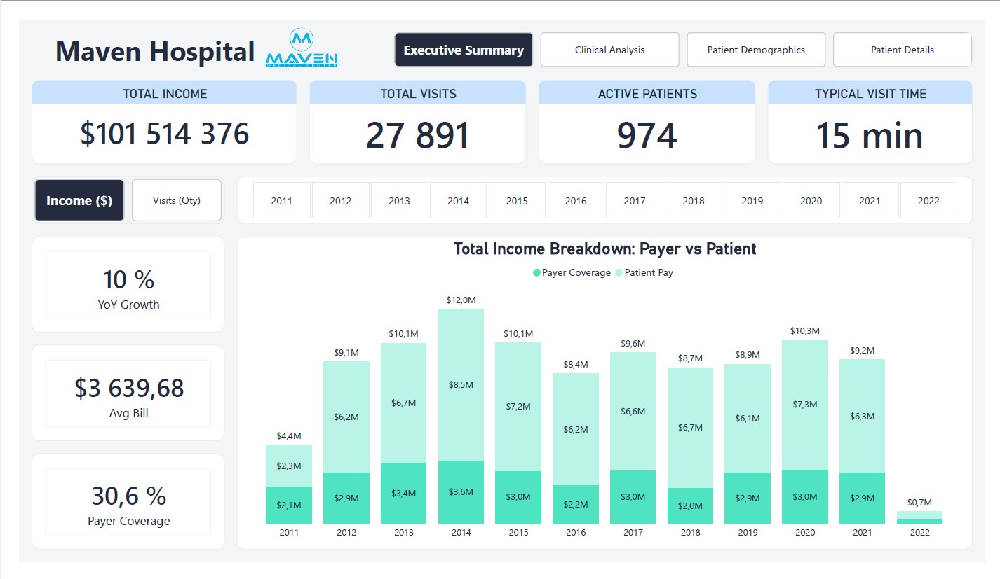
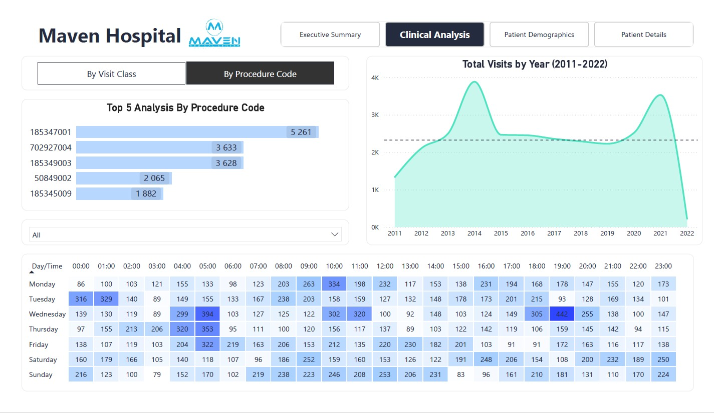
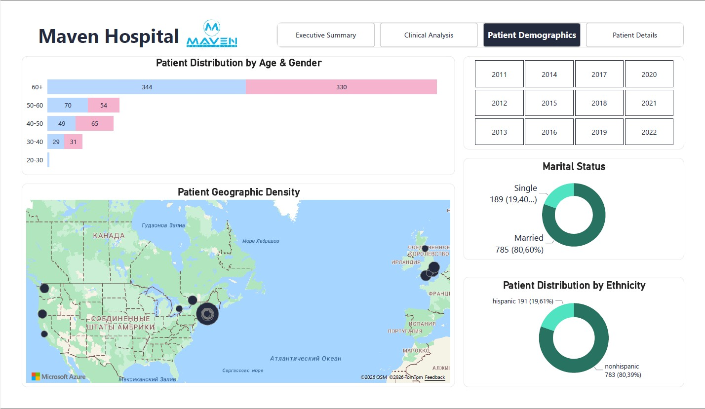
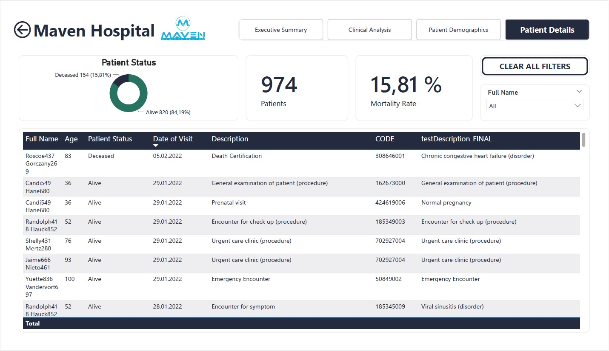

# Maven Hospital Healthcare Analytics | Power BI Dashboard

## 📌 Опис проєкту (Project Overview)
Цей проєкт присвячений комплексній аналітиці медичних та операційних показників мережі клінік **Maven Hospital**. Головна мета — надати керівництву клініки та медичному персоналу інтерактивний інструмент для моніторингу завантаженості відділень, аналізу вартості лікування, демографії пацієнтів та ефективності надання послуг.

---

## 🎬 Відео-демонстрація дашборду (Video Demo)

▶️ **[Переглянути повну відео-демонстрацію дашборду на YouTube](https://youtu.be/1bE5GafITwc)**

*У відео детально показано інтерактивність дашборду, роботу з фільтрами, зрізами даних та ключові аналітичні вкладки.*

---

## 📐 Модель даних (Data Model)

* **Архітектура:** Модель побудована за схемою **«Зірка» (Star Schema)**.
* **Зв'язки:** Налаштовано односпрямовані зв'язки **1-до-багатьох (1-to-many)** між таблицями вимірів (Dimensions) та таблицями фактів (Facts).
* **Оптимізація:** Включено спеціальну календарну таблицю для коректної роботи Time Intelligence функцій DAX.

---

## 📸 Візуалізації та структура дашборду (Dashboard Pages)

### 1. Загальний огляд (Executive Summary)

* **Головні KPI:** Ключові операційні та фінансові показники клініки.
* **Аналіз страхового покриття:** Розподіл витрат та виплат між пацієнтами та страховими компаніями.
* **Гендерний аналіз відвідуваності:** Динаміка та обсяги візитів пацієнтів у розрізі статі (чоловіки/жінки).

---

### 2. Клінічний аналіз (Clinical Analysis)

* **Причини звернень та процедури:** Аналіз найпопулярніших медичних аналізів, діагнозів та причин візитів.
* **Матриця відвідуваності («Календар візитів»):** Теплова карта завантаженості клініки по днях тижня та роках (за обраний період).
* **Загальна динаміка візитів (2011–2022):** Інтерактивна матриця з можливістю деталізації (Drill-down) за роками, кварталами та місяцями.

---

### 3. Демографія пацієнтів (Patient Demographics)

* **Соціально-демографічний профіль:** Розподіл пацієнтів за віковими групами, расовою приналежністю та сімейним станом.
* **Географічний та соціальний контекст:** Дослідження структури пацієнтів для оптимізації соціальних та медичних програм клініки.

---

### 4. Деталізація по пацієнтах (Patient Details)

* **Показники смертності:** Ключові KPI щодо кількості пацієнтів, їх статусу (живий/померлий) та рівня смертності (% mortality rate).
* **Повний реєстр візитів:** Детальна таблиця зі списками пацієнтів, датами звернень та супровідною медичною інформацією.

---

## 🛠 Технологічний стек (Tech Stack)
* **BI Інструмент:** Power BI Desktop.
* **Трансформація даних:** Power Query (M-Language).
* **Моделювання даних:** Схема «Зірка» (Star Schema), зв'язки 1-до-багатьох.
* **Аналітичні розрахунки:** DAX (Time Intelligence, CALCULATE, SUMX, Filter Contexts).
* **Візуалізація:** Custom Tooltips, Bookmarks, Page Navigation, Cross-filtering, Matrix Drill-through.

---

## 📁 Структура репозиторію (Repository Structure)
* `Maven_Hospital_Analytics.pbix` — основний файл проєкту Power BI Desktop.
* `data/` — вхідні датасети (CSV/Excel).
* `screenshots/` — зображення сторінок дашборду та моделі даних.
* `README.md` — документація проєкту.

---

## 📊 Ключові висновки та аналітика (Key Insights)
* **Завантаженість:** Виявлено пікові дні та години звернень пацієнтів для оптимізації графіку чергування лікарів.
* **Фінанси:** Визначено найбільш витратні категорії процедур та частку покриття витрат страховими компаніями.
* **Процеси:** Скорочення часу очікування та покращення розподілу ліжкового фонду клініки.
